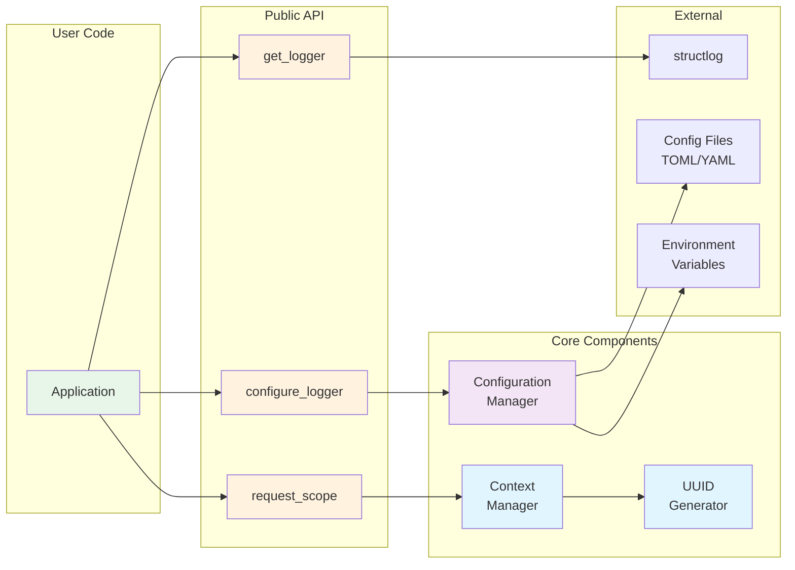
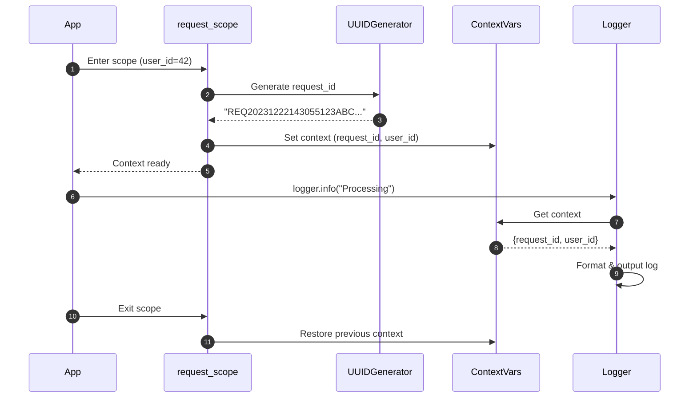
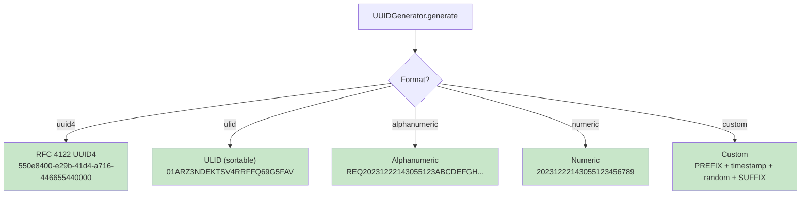
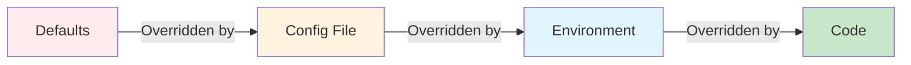
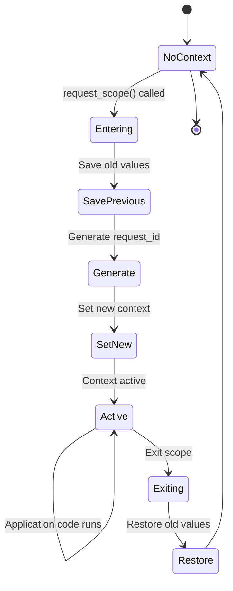
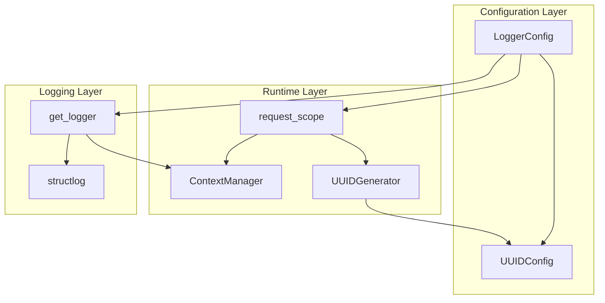

# Morado Logger & UUID System - Quick Overview

## System Architecture (High-Level)



## Request Processing Flow (Simplified)



## UUID Generation Formats



## Configuration Precedence



## Context Variable Lifecycle



## Key Components Summary

| Component | Purpose | Key Features |
|-----------|---------|--------------|
| **UUIDGenerator** | Generate unique IDs | Multiple formats, configurable, stateless |
| **ConfigurationManager** | Load & merge configs | TOML/YAML/env support, validation |
| **ContextManager** | Manage request context | Thread-safe, async-safe, auto-cleanup |
| **request_scope** | Context lifecycle | Auto-generate IDs, context isolation |
| **Decorators** | Convenience wrappers | Auto-context, execution logging |

## Data Flow Summary

### 1. Startup Configuration
```
Load defaults → Load file → Load env → Merge → Validate → Configure logger
```

### 2. Request Processing
```
Enter scope → Generate ID → Set context → Execute code → Log with context → Exit scope → Restore context
```

### 3. UUID Generation
```
Config → Select format → Generate components → Assemble → Return
```

### 4. Context Management
```
Save previous → Set new → Yield to app → Restore previous
```

## Integration Points



## Thread & Async Safety

| Component | Thread-Safe | Async-Safe | Mechanism |
|-----------|-------------|------------|-----------|
| UUIDGenerator | ✅ | ✅ | Stateless static methods |
| ContextManager | ✅ | ✅ | Python contextvars |
| Configuration | ✅ | ✅ | Immutable Pydantic models |
| request_scope | ✅ | ✅ | contextvars + proper cleanup |

## Common Usage Patterns

### Pattern 1: Basic Request Logging
```python
with request_scope(user_id=42):
    logger.info("Processing request")
```

### Pattern 2: Custom UUID Format
```python
config = UUIDConfig(format="alphanumeric", prefix="REQ", length=38)
with request_scope(user_id=42, request_id_config=config):
    logger.info("Processing")
```

### Pattern 3: Decorator-Based Context
```python
@with_request_context()
def process_request(request_id: str, user_id: int):
    logger.info("Processing")
```

### Pattern 4: Configuration from File
```python
config = ConfigurationManager.load_config("logging.toml")
configure_logger(config)
```

## Error Handling Strategy

| Error Type | Handling | Result |
|------------|----------|--------|
| Missing config file | Warning + defaults | Continue with defaults |
| Invalid config value | Warning + default | Use default value |
| UUID generation error | ValueError | Propagate to caller |
| Context cleanup error | Guaranteed cleanup | Always restores context |

## Performance Characteristics

| Operation | Performance | Notes |
|-----------|-------------|-------|
| UUID generation | ~1-10 μs | Depends on format |
| Context creation | ~1-2 μs | Very fast (contextvars) |
| Context retrieval | ~0.1 μs | O(1) lookup |
| Config loading | One-time | At startup only |
| Log output | Depends on structlog | Not measured here |

## Design Principles

1. **Separation of Concerns**: UUID, Config, Context, Logging are independent
2. **Stateless Design**: No shared mutable state
3. **Thread Safety**: Built-in via contextvars and immutability
4. **Configuration Flexibility**: Multiple sources with clear precedence
5. **Graceful Degradation**: Sensible defaults for all errors
6. **Clean API**: Simple, intuitive public interface
7. **Extensibility**: Easy to add new UUID formats, processors, etc.
