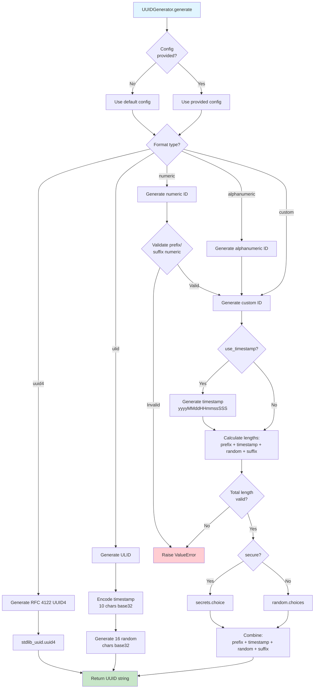
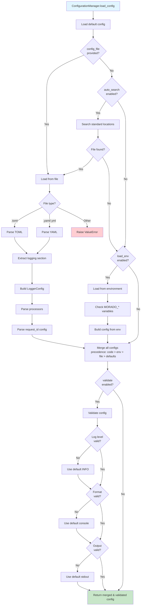
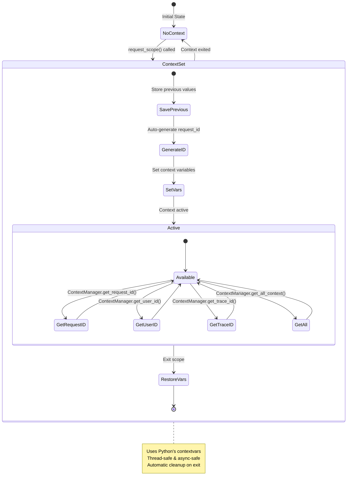
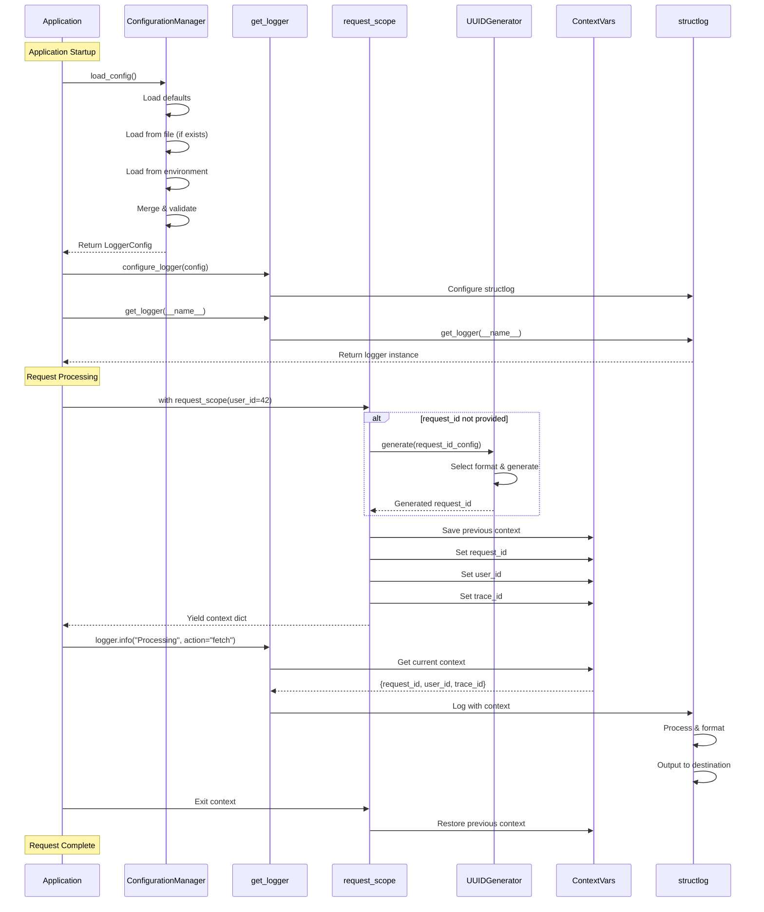

# UUID and Logger System - Data Flow Analysis

## System Overview

The Morado logging system consists of two main components:
1. **UUID Generator** - Stateless ID generation with multiple format support
2. **Logger System** - Configuration-driven logging with request-scoped context management

## Architecture Diagram

```mermaid
graph TB
    subgraph "Application Layer"
        APP[Application Code]
        MAIN[main.py]
    end
    
    subgraph "Logger Public API"
        API[__init__.py]
        API_GET[get_logger]
        API_CONFIG[configure_logger]
        API_SCOPE[request_scope]
    end
    
    subgraph "Configuration Layer"
        CONFIG[config.py]
        LOGGER_CFG[LoggerConfig]
        UUID_CFG[UUIDConfig]
        CFG_MGR[ConfigurationManager]
        
        LOGGER_CFG --> UUID_CFG
    end
    
    subgraph "Context Management Layer"
        CTX[context.py]
        CTX_MGR[ContextManager]
        REQ_CTX[RequestContext]
        CTX_VARS[ContextVars]
        
        CTX_MGR --> CTX_VARS
        REQ_CTX --> CTX_VARS
    end
    
    subgraph "UUID Generation Layer"
        UUID[uuid.py]
        UUID_GEN[UUIDGenerator]
        UUID_METHODS[generate/uuid4/ulid/alphanumeric/numeric]
    end
    
    subgraph "Decorator Layer"
        DEC[decorators.py]
        DEC_REQ[with_request_context]
        DEC_ASYNC[async_with_request_context]
        DEC_LOG[log_execution]
    end
    
    subgraph "External Dependencies"
        STRUCTLOG[structlog]
        PYDANTIC[pydantic]
        STDLIB[Python stdlib]
    end
    
    %% Application to API
    APP --> API_GET
    APP --> API_CONFIG
    APP --> API_SCOPE
    MAIN --> API
    
    %% API to Components
    API_GET --> STRUCTLOG
    API_CONFIG --> CONFIG
    API_SCOPE --> CTX
    
    %% Configuration Flow
    CFG_MGR --> LOGGER_CFG
    CFG_MGR --> UUID_CFG
    CONFIG --> PYDANTIC
    
    %% Context to UUID
    CTX --> UUID_GEN
    API_SCOPE --> UUID_GEN
    
    %% UUID Dependencies
    UUID_GEN --> UUID_CFG
    UUID_GEN --> STDLIB
    UUID --> PYDANTIC
    
    %% Decorator Dependencies
    DEC_REQ --> CTX
    DEC_ASYNC --> CTX
    DEC_LOG --> STRUCTLOG
    
    style UUID fill:#e1f5ff
    style CTX fill:#fff3e0
    style CONFIG fill:#f3e5f5
    style API fill:#e8f5e9


## Data Flow Diagrams

### 1. Request Scope Creation Flow

```mermaid
sequenceDiagram
    participant App as Application
    participant Scope as request_scope
    participant CtxMgr as ContextManager
    participant UUIDGen as UUIDGenerator
    participant CtxVars as ContextVars
    
    App->>Scope: with request_scope(user_id=42)
    
    Note over Scope: Check if request_id provided
    
    alt request_id is None
        Scope->>UUIDGen: generate(config)
        UUIDGen->>UUIDGen: Select format (alphanumeric/uuid4/ulid/numeric)
        UUIDGen->>UUIDGen: Generate timestamp (if use_timestamp=True)
        UUIDGen->>UUIDGen: Generate random part (secure/non-secure)
        UUIDGen->>UUIDGen: Combine prefix + timestamp + random + suffix
        UUIDGen-->>Scope: return generated_id
    end
    
    Scope->>CtxVars: Store previous values
    Scope->>CtxVars: set request_id
    Scope->>CtxVars: set user_id
    Scope->>CtxVars: set trace_id
    
    Scope-->>App: yield context dict
    
    Note over App: Execute application code<br/>with context available
    
    App->>Scope: Exit context
    Scope->>CtxVars: Restore previous values
```

### 2. UUID Generation Flow



### 3. Configuration Loading Flow



### 4. Context Variable Management Flow



### 5. Complete Request Processing Flow



## Component Responsibilities

### UUID Generator (`uuid.py`)
- **Purpose**: Generate unique identifiers in various formats
- **Key Features**:
  - Multiple formats: uuid4, ulid, alphanumeric, numeric, custom
  - Configurable prefix/suffix
  - Optional timestamp inclusion
  - Secure/non-secure random generation
  - Stateless design (no dependencies on logger)
- **Dependencies**: 
  - Python stdlib (uuid, secrets, random, time, datetime)
  - Pydantic (for UUIDConfig validation)

### Configuration Manager (`config.py`)
- **Purpose**: Load, validate, and merge logger configurations
- **Key Features**:
  - Multiple config sources (file, environment, code)
  - TOML and YAML support
  - Configuration precedence chain
  - Validation with defaults
  - Processor configuration
  - UUID config integration
- **Dependencies**:
  - tomllib (Python 3.11+)
  - PyYAML (optional, for YAML support)
  - Pydantic (for validation)
  - UUIDConfig from uuid.py

### Context Manager (`context.py`)
- **Purpose**: Manage request-scoped context variables
- **Key Features**:
  - Thread-safe context variables (contextvars)
  - Async-safe context management
  - Auto-generation of request_id
  - Context preservation and restoration
  - Support for additional custom fields
- **Dependencies**:
  - Python contextvars
  - UUIDGenerator (for auto-generation)

### Decorators (`decorators.py`)
- **Purpose**: Provide convenient decorators for context and logging
- **Key Features**:
  - Automatic context extraction from function arguments
  - Sync and async support
  - Execution logging with entry/exit/exception
  - Configurable argument and result logging
- **Dependencies**:
  - context.py (for request_scope)
  - structlog (for logging)
  - Python inspect and functools

### Public API (`__init__.py`)
- **Purpose**: Provide clean, unified API for users
- **Key Features**:
  - Single import point for all functionality
  - Graceful fallback if logger.py not implemented
  - Re-exports all public interfaces
- **Dependencies**:
  - All internal modules
  - structlog (with fallback)

## Data Flow Patterns

### Pattern 1: Configuration Cascade
```
Defaults → File Config → Environment Variables → Code Config
(lowest precedence)                        (highest precedence)
```

### Pattern 2: Context Lifecycle
```
1. Save previous context
2. Generate request_id (if needed)
3. Set new context variables
4. Execute application code
5. Restore previous context
```

### Pattern 3: UUID Generation
```
Config → Format Selection → Component Generation → Assembly → Return
         (uuid4/ulid/etc)   (prefix/timestamp/   (combine)
                             random/suffix)
```

## Key Design Principles

1. **Separation of Concerns**
   - UUID generation is completely independent of logging
   - Configuration is separate from runtime behavior
   - Context management is isolated from logging implementation

2. **Stateless Design**
   - UUIDGenerator has no internal state
   - All methods are static
   - Configuration is immutable (Pydantic models)

3. **Thread & Async Safety**
   - Uses Python's contextvars for context management
   - No shared mutable state
   - Proper context cleanup in all scenarios

4. **Configuration Flexibility**
   - Multiple configuration sources
   - Clear precedence rules
   - Validation with sensible defaults
   - Environment variable overrides

5. **Extensibility**
   - Processor configuration for custom log processing
   - Custom UUID formats
   - Additional context fields support
   - Pluggable configuration sources

## Integration Points

### UUID ↔ Logger Integration
- Logger configuration includes `request_id_config: UUIDConfig`
- `request_scope()` uses UUIDGenerator for auto-generation
- Configuration flows from LoggerConfig to context creation

### Context ↔ Logger Integration
- Context variables are automatically included in log output
- ContextManager provides current context to logger
- Decorators bridge function arguments to context

### Configuration ↔ All Components
- LoggerConfig is the central configuration object
- UUIDConfig is embedded in LoggerConfig
- ProcessorConfig defines custom log processors
- All components respect configuration settings

## Example Usage Flows

### Basic Logging with Auto-Generated Request ID
```python
from morado.common.logger import get_logger, request_scope

logger = get_logger(__name__)

with request_scope(user_id=42):  # request_id auto-generated
    logger.info("Processing request")
    # Output includes: request_id, user_id, timestamp, message
```

**Data Flow**:
1. `request_scope()` called without request_id
2. UUIDGenerator.generate() called with default config
3. Alphanumeric UUID (length 38) generated
4. Context variables set: request_id, user_id
5. Logger retrieves context from ContextManager
6. Log output includes all context fields

### Custom UUID Configuration
```python
from morado.common.logger import request_scope
from morado.common.utils.uuid import UUIDConfig

config = UUIDConfig(
    format="alphanumeric",
    prefix="REQ",
    length=38,
    use_timestamp=True
)

with request_scope(user_id=42, request_id_config=config):
    logger.info("Processing")
    # request_id format: REQ + timestamp + random
```

**Data Flow**:
1. UUIDConfig created with custom settings
2. `request_scope()` receives config
3. UUIDGenerator.generate(config) called
4. Custom format applied: prefix + timestamp + random
5. Context set with custom request_id
6. Logger includes custom request_id in output

### Configuration from File
```python
from morado.common.logger import configure_logger
from morado.common.logger.config import ConfigurationManager

# Load from file with environment overrides
config = ConfigurationManager.load_config(
    config_file="logging.toml",
    load_env=True
)

configure_logger(config)
```

**Data Flow**:
1. Default config loaded
2. TOML file parsed
3. Environment variables checked
4. Configs merged (defaults < file < env)
5. Validation applied
6. Logger system configured with merged config

## Thread Safety & Async Safety

### Context Variables (contextvars)
- Each thread/async task has its own context
- Context changes don't affect other threads/tasks
- Automatic cleanup on context exit
- No locks or synchronization needed

### UUID Generation
- Stateless static methods
- No shared mutable state
- `secrets` module for cryptographically secure random
- Thread-safe by design

### Configuration
- Immutable Pydantic models
- Configuration loaded once at startup
- No runtime modification of config
- Thread-safe reads

## Performance Considerations

### UUID Generation
- **uuid4**: Fast (stdlib implementation)
- **ulid**: Fast (simple base32 encoding)
- **alphanumeric/numeric**: Fast (simple random generation)
- **secure=True**: Slightly slower (cryptographic random)
- **use_timestamp=True**: Minimal overhead (datetime formatting)

### Context Management
- **contextvars**: Very fast (C implementation)
- **Context creation**: Minimal overhead (3 variable sets)
- **Context retrieval**: O(1) lookup
- **Memory**: Minimal (only active contexts stored)

### Configuration Loading
- **File parsing**: One-time cost at startup
- **Validation**: One-time cost at startup
- **Runtime**: Zero overhead (config is immutable)

## Error Handling

### UUID Generation Errors
- Invalid charset → ValueError
- Invalid length → ValueError
- Prefix/suffix too long → ValueError
- Non-numeric prefix/suffix for numeric format → ValueError

### Configuration Errors
- File not found → Warning + use defaults
- Malformed file → ValueError
- Invalid log level → Warning + use INFO
- Invalid format → Warning + use console
- Invalid output → Warning + use stdout

### Context Errors
- No errors thrown (graceful defaults)
- Missing context variables → None returned
- Context cleanup guaranteed (try/finally)

## Testing Strategy

### UUID Tests
- Format validation
- Length constraints
- Prefix/suffix handling
- Timestamp inclusion
- Secure vs non-secure random
- Edge cases (empty charset, zero length)

### Configuration Tests
- File loading (TOML, YAML)
- Environment variable loading
- Config merging
- Validation
- Error handling
- Default values

### Context Tests
- Context creation and cleanup
- Thread safety
- Async safety
- Context nesting
- Auto-generation
- Context retrieval

### Integration Tests
- End-to-end request flow
- Configuration → UUID → Context → Logger
- Multiple concurrent requests
- Async request handling
